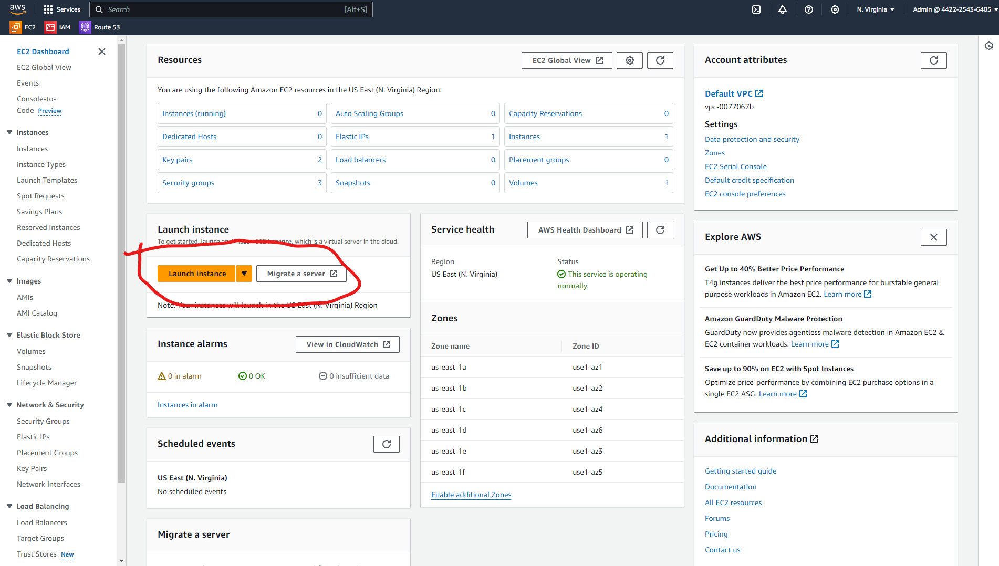
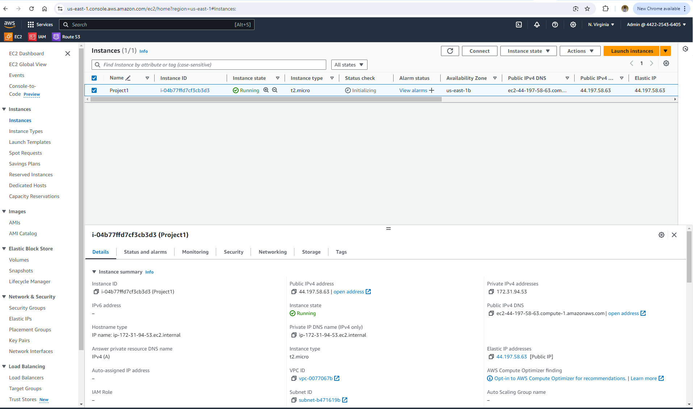
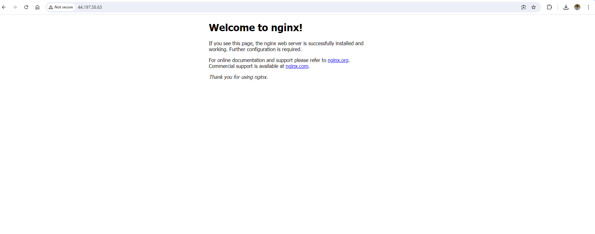
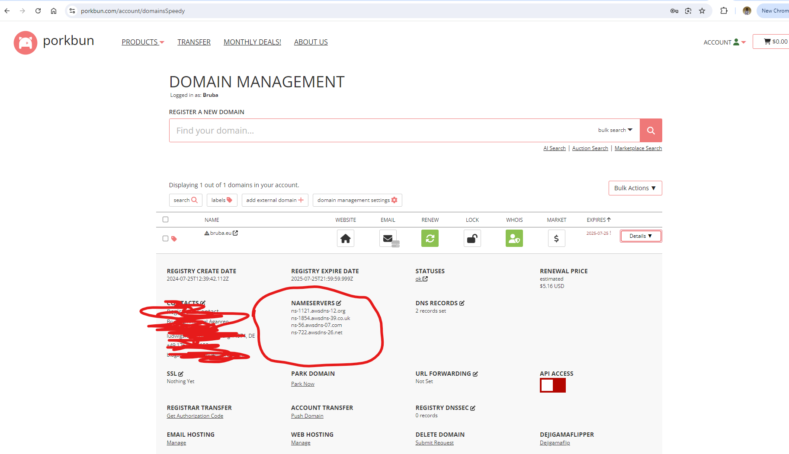
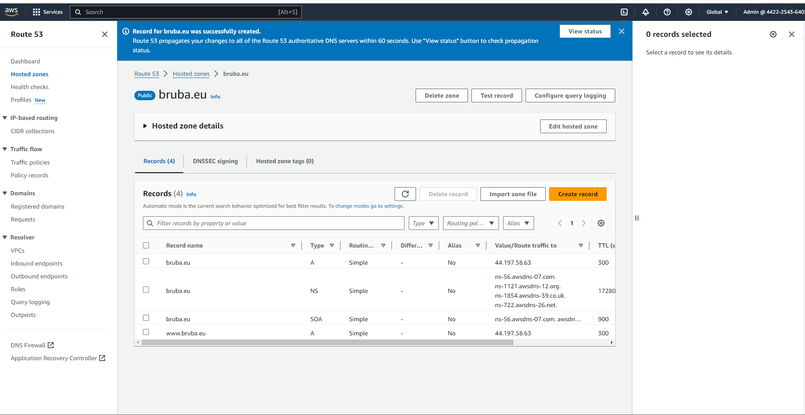
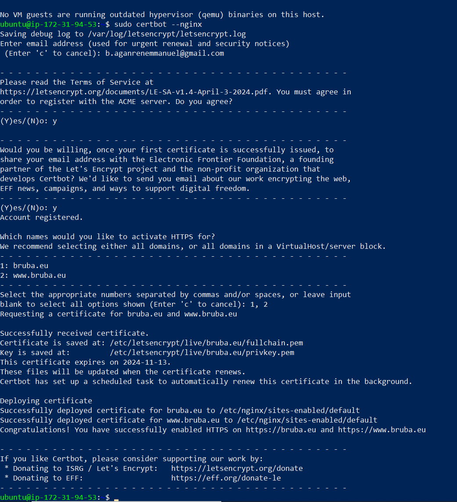

# Setup a Static Website Using Nginx
 - these are the steps to accomplish this
### Create An Ubuntu Server on AWS
- create an account on AWS
- locate EC2
- EC2 enables you to start varoius operating systems within the AWS cloud environment

- Click on **Launch Instance**

- you can see a variety of instances, for this i chose Ubuntu
- **Name** your instance and select the **Ubuntu** AMI.

- confirm that the instance is up and running

### Create and Assign an Elastic IP

- Select **Elastic IPs** under **Network & Security**

### Install Nginx
- Execute the following commands.

`sudo apt update`

`sudo apt upgrade`

`sudo apt install nginx`

- Start your Nginx server by running the **`sudo systemctl start nginx`** command, enable it to start on boot by executing **`sudo systemctl enable nginx`**, and then confirm if it's running with the **`sudo systemctl status nginx`** command.

- Download your website template from your preferred website by navigating to the website, locating the template you want, and obtaining the download URL for the website.

### Create An A Record
To make your website accessible via your domain name rather than the IP address, you'll need to set up a DNS record. I did this by buying my domain from Porkbun and then moving hosting to AWS Route 53, where I set up an A record.

- Go back to your AWS console, search for **Route 53①**, and then choose **Route 53②** from the list of services shown.

- Select **Create hosted zones** and click on **Get started**.

- Enter your **Domain name**, choose **Public hosted zone** and then click on **Create hosted zone**.

- Select the **created hosted zone** and copy the assigned **Values**.

- Go back to your domain registrar and select **Custom DNS** within the **NAMESERVERS** section.

- Head back to your AWS console and click on **Create record**.

### Install certbot and Request For an SSL/TLS Certificate

- Install certbot by executing the following commands:
**`sudo apt update`**
**`sudo apt install certbot python3-certbot-nginx`**

- Execute the **`sudo certbot --nginx`** command to request your certificate. Follow the instructions provided by certbot and select the domain name for which you would like to activate HTTPS.

- Goto **`https://<domain name>`** to view your website.

