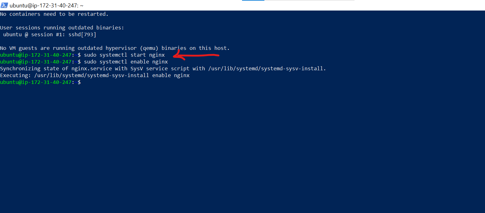
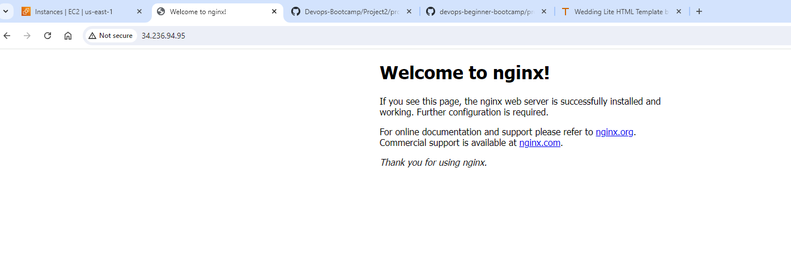

# Setup Multiple Static Websites on a Single Server Using Nginx Virtual Hosts

In this project, you will learn the concept of subdomains and hosting multiple websites on a single server using Nginx Virtual Host configuration.

## Documentation

Please reference [**Project1**](https://github.com/StrangeJay/devops-beginner-bootcamp/blob/main/project1/project1.md) for guidance on spinning up an Ubuntu server, as well as creating and associating an elastic IP address with your server, among other tasks.

- Spin up your ubuntu server, create an elastic IP and associate it to your instance.

### Install Nginx and Setup Your Website

- Execute the following commands.

`sudo apt update`

`sudo apt upgrade`

`sudo apt install nginx`

- Start your Nginx server by running the `sudo systemctl start nginx` command, enable it to start on boot by executing `sudo systemctl enable nginx`, and then confirm if it's running with the `sudo systemctl status nginx` command.

- Visit your instances IP address in a web browser to view the default Nginx startup page.

- Download your website template from your preferred website by navigating to the website, locating the template you want.

- Right click and select **Inspect** from the drop down menu.

- Click on the **Network** tab and then click **Download** button.

- Right click on the website name, select **Copy** and click on **Copy link address**.
