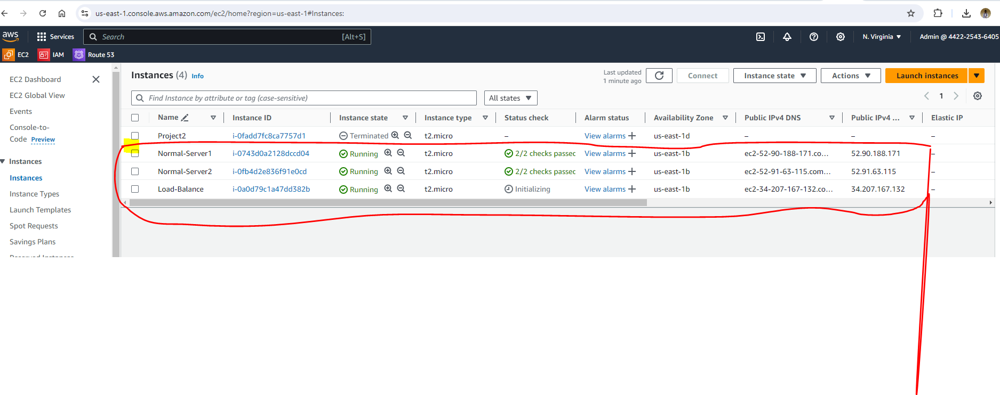
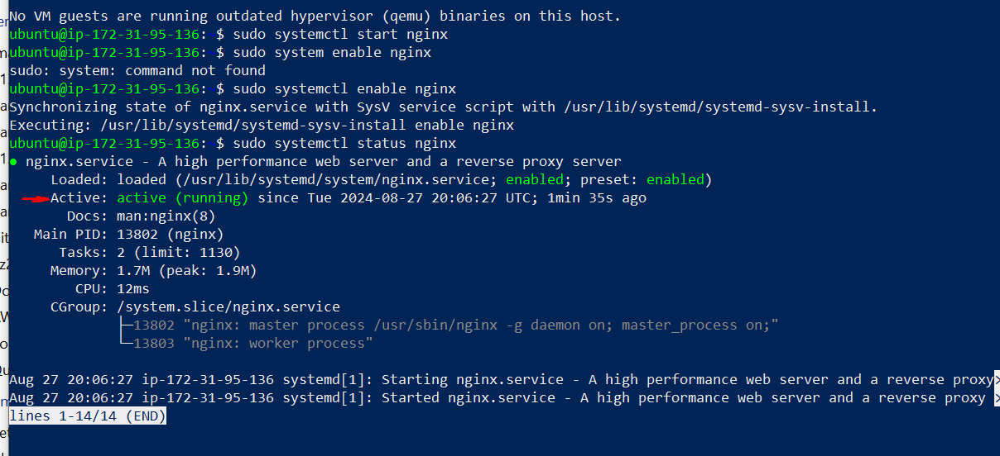
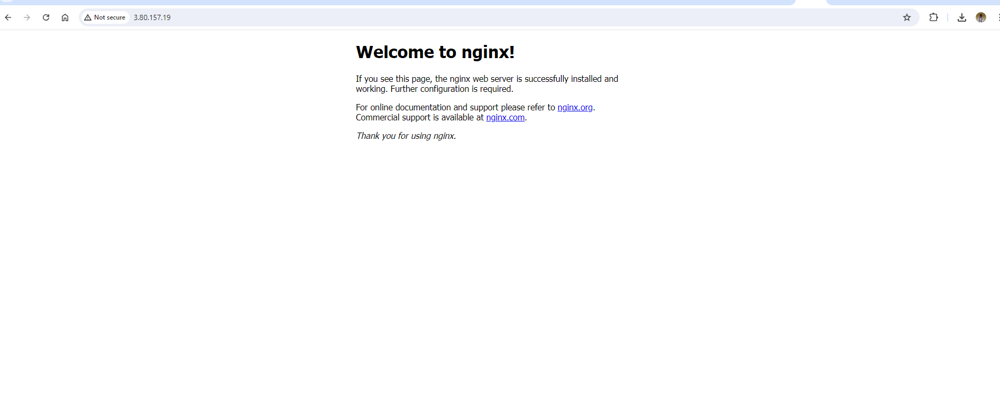
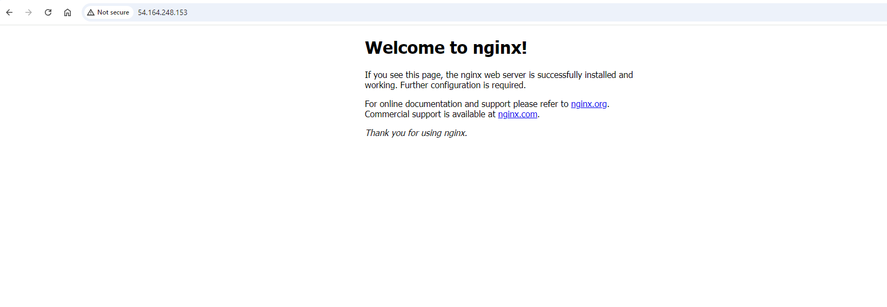
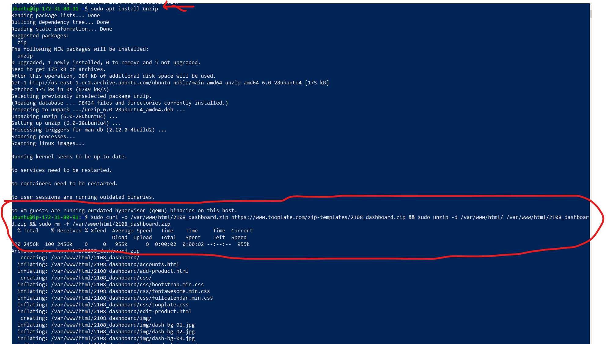
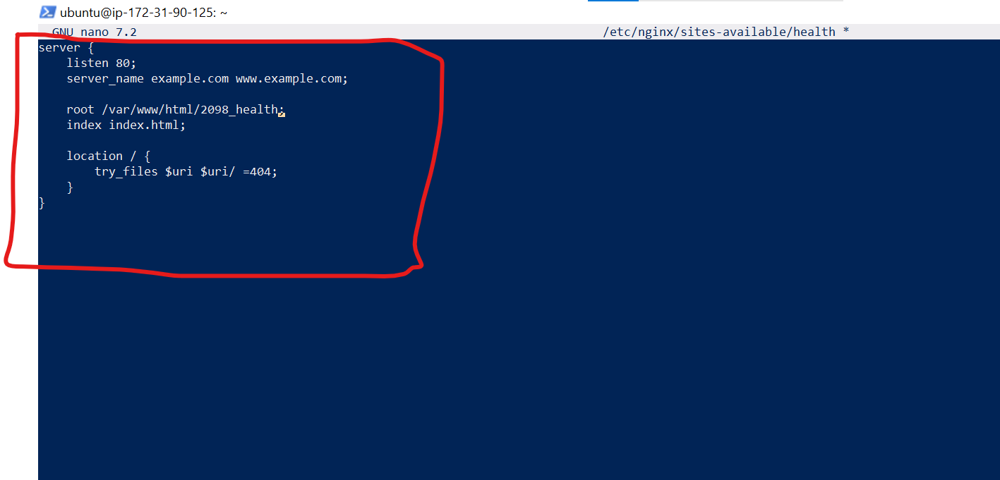
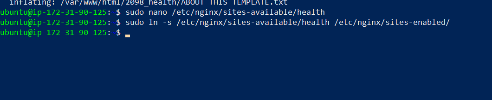

# Project 3: Setup Load Balancing for Static Website Using Nginx

This project aims to teach Layer 7 load balancing and load balancing algorithms using Nginx as a Load Balancer.

## Type of Load Balancer

This is a reverse proxy load balancer configuration in Nginx, where Nginx acts as an intermediary for requests from clients seeking resources from the servers behind it. It's capable of distributing traffic across the servers listed in the upstream block.

## Characteristics

- **HTTP Load Balancing:** This configuration balances HTTP requests.

- **Round Robin:** By default, Nginx uses a round-robin algorithm to distribute traffic evenly among the servers unless otherwise specified.

- **Scalability:** You can add more servers in the upstream block to scale out your application.

>[!Note]
If you need more advanced load balancing methods (e.g., least connections, IP hash), you can configure Nginx to use those as well.

|S/N | Project Tasks                                                                                              |
|----|------------------------------------------------------------------------------------------------------------|
| 1  |Deploy three servers                                                                                        |
| 2  |Set up static websites on two servers using Nginx.                                                          |
| 3  |Use two separate HTML files with distinct content. Deploy one file to each server's index.html location.    |
| 4  |Set up Nginx on the third server. It will act as a load balancer.                                           |
| 5  |Configure Nginx to load and balance traffic between two static websites.                                    |
| 6  |Add the Nginx Load balancer IP to the DNS A record.                                                         |
| 7  |Try accessing the website. Every time you reload the website you should see a different index.html.         |

## Key Concepts Covered

- AWS (EC2 and Route 53)
- EC2
- Linux(Ubuntu)
- Nginx
- DNS
- **Load balancing**
- SSL (certbot)
- OpenSSL command

## Checklist

- [x] Task 1: Deploy three servers.
- [x] Task 2: Set up static websites on two servers using Nginx.
- [x] Task 3: Make a small change in the index.html file of one of the websites to differentiate between two servers OR For a clearer distinction, use two separate HTML files with distinct content.
- [x] Task 4: Set up Nginx on the third server. It will act as a load balancer.
- [x] Task 5: Configure Nginx to load and balance traffic between two static websites.
- [x] Task 6: Add the Nginx Load balancer IP to the DNS A record.
- [x] Task 7: Try accessing the website. Every time you reload the website you should see a different index.html.

## Documentation

Please reference [**Project1**](https://github.com/StrangeJay/devops-beginner-bootcamp/blob/main/project1/project1.md) for guidance on spinning up an Ubuntu server, as well as creating and associating an elastic IP address with your server, among other tasks.

- Spin up your 3 ubuntu servers. Ensure you clearly name them so you don't make mistakes.



### Install Nginx and Setup Your Website

> [!NOTE]

- Install Nginx on both web server terminals. These are the terminals you're using to manage the servers hosting the two distinct website contents that the load balancer will distribute traffic to.

- To install Nginx, execute the following commands on your terminal.

`sudo apt update`

`sudo apt upgrade`

`sudo apt install nginx`

- Start your Nginx server by running the `sudo systemctl start nginx` command, enable it to start on boot by executing `sudo systemctl enable nginx`, and then confirm if it's running with the `sudo systemctl status nginx` command.

- Visit your instances IP address in a web browser to view the default Nginx startup page for 2 servers.
 

- Execute `sudo apt install unzip` to install the unzip tool and run the following command to download and unzip your website files `sudo curl -o /var/www/html/2135_mini_finance.zip https://www.tooplate.com/zip-templates/2135_mini_finance.zip && sudo unzip -d /var/www/html/ /var/www/html/2135_mini_finance.zip && sudo rm -f /var/www/html/2135_mini_finance.zip`.



- To set up your website's configuration, start by creating a new file in the Nginx sites-available directory. Use the following command to open a blank file in a text editor: `sudo nano /etc/nginx/sites-available/health`.

- Copy and paste the following code into the open text editor.

```
server {
    listen 80;
    server_name example.com www.example.com;

    root /var/www/html/2098_health;
    index index.html;

    location / {
        try_files $uri $uri/ =404;
    }
}
```

- Edit the `root` directive within your server block to point to the directory where your downloaded website content is stored.


- Create a symbolic link for both websites by running the following command.
`sudo ln -s /etc/nginx/sites-available/health /etc/nginx/sites-enabled/`



- Run the `sudo nginx -t` command to check the syntax of the Nginx configuration file, and when successful run the `sudo systemctl restart nginx` command.


- Repeat the process for the second website.

> [!NOTE]
To better identify the impact of your changes, connect to the second server in a new terminal window. There, update the website content with something different. When you reload your website, the load balancer will distribute traffic, potentially sending you to the updated version on the second server. This will make the differences between the two versions clearer.