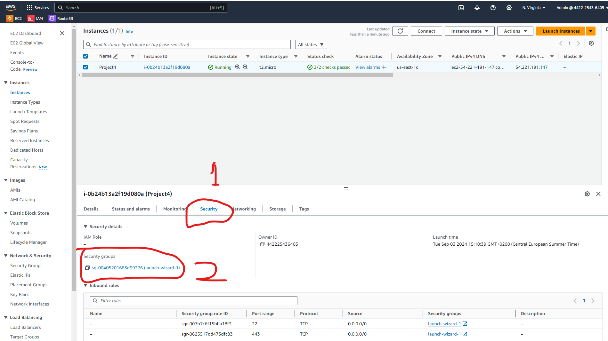
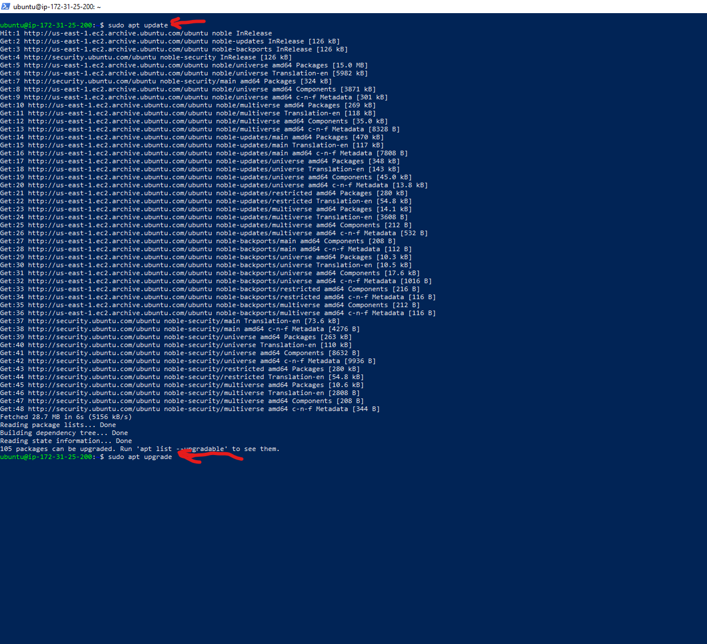

# Project 4 Setup WordPress Website Using LAMP Stack

Setting up a WordPress website using the LAMP stack (Linux, Apache, MySQL, PHP) is a powerful way to create a robust and scalable web presence. This project will guide you through each step of the process, from setting up your server environment to installing WordPress and configuring it for optimal performance. Whether you're a seasoned developer or a beginner, this tutorial will provide you with the knowledge and skills needed to deploy a fully functional WordPress site. By the end of this guide, you'll have a solid understanding of how to leverage the LAMP stack to build and manage your own WordPress website, ensuring a secure, efficient, and customizable platform for your content.

**Key Features:**

- Step-by-step instructions for installing and configuring LAMP components.
- Secure database creation for your WordPress website.
- User-friendly guide for completing the WordPress installation process.

**Benefits:**

- Gain independence by managing your own WordPress website.
- Understand the core technologies behind WordPress.
- Customize your website to your exact needs.
- Embrace the flexibility and power of WordPress.

## Introduction

Before we begin, let's review the tools we'll be using throughout this project.

### Linux

Linux is the cornerstone of the LAMP stack, serving as the operating system that underpins the entire infrastructure. As an open-source and highly customizable platform, Linux provides a stable and secure environment for hosting web applications. Its efficiency in handling processes and resources makes it an ideal choice for web servers. In a LAMP stack, Linux coordinates the interaction between Apache (the web server), MySQL (the database), and PHP (the scripting language), ensuring seamless operation and communication between these components. This foundation allows for high performance, flexibility, and scalability, making Linux a crucial element in the successful deployment and management of a LAMP-based WordPress website.

### Apache

Apache is a critical component of the LAMP stack, acting as the web server that handles client requests and serves web content. As an open-source and widely used web server software, Apache is known for its reliability, security, and flexibility. In a LAMP stack, Apache processes incoming HTTP requests, fetching and delivering web pages to users' browsers. It also supports various modules that extend its functionality, such as URL redirection, authentication, and load balancing. By efficiently managing web traffic and providing a stable platform for running web applications, Apache ensures that your WordPress website runs smoothly and can handle a large number of concurrent users.

### MySQL

MySQL is the database management system within the LAMP stack, responsible for storing and managing the data that powers your web applications. As an open-source relational database, MySQL offers robust performance, scalability, and security. In the context of a LAMP stack, MySQL works closely with PHP to handle data operations such as storing user information, retrieving content, and managing transactions. For a WordPress website, MySQL stores all the content, user data, settings, and other essential information, allowing for dynamic content generation and efficient data retrieval. By ensuring data integrity and providing powerful querying capabilities, MySQL plays a crucial role in maintaining the functionality and performance of a WordPress site on the LAMP stack.

### PHP

PHP is the scripting language in the LAMP stack, responsible for generating dynamic web content. As a server-side language, PHP processes code on the web server to create HTML content that is then sent to the user's browser. In the LAMP stack, PHP works in tandem with Apache to handle web requests and interact with the MySQL database to retrieve and manipulate data. For a WordPress website, PHP executes the core logic that powers the site, managing everything from user authentication to content management and plugin functionality. By seamlessly integrating with Apache and MySQL, PHP ensures that your WordPress site is dynamic, interactive, and capable of delivering a rich user experience.

---
## Project 4

|S/N | Project Tasks                                                       |
|----|---------------------------------------------------------------------|
| 1  |Deploy an Ubuntu Server                                              |
| 2  |Set up your LAMP stack on the server                                 |
| 3  |Configure the wordpress Application                                  |
| 4  |Map the IP address to the DNS A record                               |
| 5  |Validate the WordPress website setup by accessing the web address.   |

## Key Concepts Covered in this project:

- AWS (EC2 and Route 53)
- Linux(Ubuntu)
- Apache
- MySQL
- PHP
- Wordpress
- DNS
- SSL (certbot)
- OpenSSL command

## Checklist

- [x] Task 1: Deploy an Ubuntu Server
- [x] Task 2: Set up your LAMP stack on the server
- [x] Task 3: Configure the wordpress Application
- [x] Task 4: Map the IP address to the DNS A record
- [x] Task 5: Validate the WordPress website setup by accessing the web address.

## Documentation

Please reference [**Project1**](https://github.com/StrangeJay/devops-beginner-bootcamp/blob/main/project1/project1.md) for guidance on spinning up an Ubuntu server. and confirm the server is up and running

- Set an inbound rule for MYSQL in your security group. Click on **Security①** and select the **Security group②**.

-Click on  **Edit Inbound rule**  and then click on **Add rule**

 

- Click on **Custom TCP** and select **MySQL/Aurora**.

- Enter the **IP address①** you want to allow access and click **Save rules②**.

> [!NOTE]
You can choose 0.0.0.0/0 to permit access from anywhere, but for added security, restrict access to MySQL exclusively to your Web Server’s IP address. In the Inbound Rule configuration, specify the source as /32

- Open your **terminal**, cd into the folder where your keypair is located and connect to your Ubuntu server via SSH.

### Install Apache WEB Server on your Ubuntu Machine

- To install Apache, run the following commands in your terminal.

**`sudo apt update`** and **`sudo apt upgrade`**

**`sudo apt install apache2`**

- To enable Apache to start on boot, execute **`sudo systemctl enable apache2`①**, and then verify its status with the **`sudo systemctl status apache2`②** command.

- Now, let's check if our server is running and accessible both locally and from the Internet by executing the following command: **`curl http://localhost:80`**. it should show a default html file

*Now, it's time to test how our Apache HTTP server responds to requests from the Internet.*

- Copy your **public IPv4 address** from your EC2 dashboard.

- Open a web browser of your choice and try accessing the following URL: **`http://<Public-IP-Address>:80`**

- If the installation was successful, you should see this page.

### Install MYSQL

- To install this software using 'apt', run the command **`sudo apt install mysql-server`**. When prompted, confirm the installation by typing 'Y' and then pressing ENTER.

- After the installation is complete, log in to the MySQL console by typing: **`sudo mysql`**.

> [!NOTE]
It's recommended that you run a security script included with MySQL to enhance security. Before running the script, set a password for the root user using the default authentication method **mysql_native_password**. you can choose any password you prefer.

- Run the following command to set the password for the root user with the MySQL native password authentication method: **`ALTER USER 'root'@'localhost' IDENTIFIED WITH mysql_native_password BY 'pass';`**. Exit the MySQL shell when you're done by typing **`exit`**.

- Start the interactive script by running: **`sudo mysql_secure_installation`①**. Answer **y**② for yes, or any other key to continue without enabling specific options.

- Set your **password validation policy level**.Type 0 for LOW password policy level

> [!NOTE]
the password validation policy level was set to 0 because I don't require much security, as I will be terminating all resources immediately after this project. However, on the job, it's advised to use the strongest level, which is 2.

- Enable MySQL to start on boot by executing **`sudo systemctl enable mysql`①**, and then confirm its status with the **`sudo systemctl status mysql`②** command.

### Install PHP

- Install PHP along with required extensions by running the following script: **`sudo apt install php-curl php-gd php-mbstring php-xml php-xmlrpc php-soap php-intl php-zip`**.

**`sudo apt install php libapache2-mod-php php-mysql`**

- Confirm the downloaded PHP version by running **`php -v`**.

### Creating A Virtual Host For Your Website Using Apache
