# Setup Service Discovery Using Nginx & Consul

In DevOps, service discovery is all about automating how services find each other on a network. It's especially important in modern architectures with microservices, where applications are built from many small, independent services.

Traditionally, services were hardcoded with the locations of other services (like IP addresses). This becomes a nightmare to manage as things change and services are dynamically scaled up or down.

## Introduction

Before we start, let's go over the basics of service discovery and introduce the service discovery tool we'll be using for this project.

### Key Concepts of Service Discovery

1. **Service Registration:** This involves adding a new service instance to the service registry so that it can be discovered by other services. Each service instance must provide its network location (e.g., IP address and port) and other metadata.

2. **Service Registry:** This is a database of available service instances. It acts as a central repository where all the service instances are registered and their statuses are monitored. Examples include Consul, Eureka, and etcd.

3. **Service Lookup/Discovery:** This is the process by which a service finds the network locations of other services it needs to communicate with. Discovery can be done in several ways:

   - **Client-Side Discovery:** The client is responsible for querying the service registry to find an available service instance and then makes a request directly to that instance.

   - **Server-Side Discovery:** The client makes a request to a load balancer or API gateway, which queries the service registry and forwards the request to an available service instance.

4. **Health Checks:** These are used to monitor the health and availability of service instances. Services that fail health checks can be removed from the service registry to ensure that clients do not attempt to communicate with unavailable services.

### Benefits of Service Discovery

- **Dynamic Scalability:** As services scale up and down, service discovery ensures that the correct instances are always available.

- **Fault Tolerance:** By continually monitoring service health and availability, service discovery helps maintain robust communication between services.

- **Simplified Configuration:** Instead of hardcoding service locations, developers can use the service registry, making configuration simpler and more maintainable.

### Implementations

- **Consul:** A service mesh solution that provides service discovery, health checking, and a distributed key-value store.

- **Eureka:** A REST-based service used for locating services for the purpose of load balancing and failover in the cloud, often used with Spring Cloud.

- **etcd:** A distributed key-value store that can be used for service discovery, among other things.

- **ZooKeeper:** a powerful tool used to implement service discovery in distributed systems, providing essential coordination features such as centralized configuration management, naming services, and distributed synchronization.

### Example Workflow

- **Service Registration:** When a new service instance starts, it registers itself with the service registry, providing its address and metadata.

- **Health Checks:** The service registry periodically checks the health of registered services.

- **Service Discovery:** When a service needs to communicate with another service, it queries the service registry to find available instances.

- **Load Balancing:** If multiple instances of a service are available, the client or a load balancer can distribute requests among them.

### Use Cases

- **Microservices:** Ensuring that microservices can find each other dynamically as they scale and move across different nodes in a cluster.

- **Dynamic Environments:** In environments where services are frequently added, removed, or updated, service discovery helps maintain seamless communication.

Service discovery is an essential part of modern DevOps practices, enabling the efficient and reliable communication of services in dynamic and scalable environments.

### Consul

Consul is an open-source tool by HashiCorp for service discovery, configuration management, and network automation in distributed systems. It allows services to register and discover each other, performs health checks, and provides a distributed key/value store for configuration data. Consul supports secure service-to-service communication, multi-datacenter setups, and advanced service mesh capabilities, making it ideal for managing microservices and dynamic cloud environments.

---

## Project 5

|S/N | Project Tasks                                      |
|----|----------------------------------------------------|
| 1  |Deploy 4 Ubuntu Server                              |
| 2  |Allow required ports in the security group          |
| 3  |Set up architecture                                 |
| 4  |Setup Consul Server                                 |
| 5  |Setup Backend Servers                               |
| 6  |Setup Load-Balancer                                 |
| 7  |Validate Service Discovery Setup                    |

## Key Concepts Covered

- AWS (EC2 and Route 53)
- Linux(Ubuntu)
- Nginx
- Consul
- Environment Setup
- Service Registration with Consul
- Health Checks and Failover
- Load Balancing
- Monitoring and Logging
- Testing and Validation

## Checklist

- [x] Task 1: Deploy 4 Ubuntu Server
- [x] Task 2: Allow required ports in the security group
- [x] Task 3: Set up architecture
- [x] Task 4: Setup Consul Server
- [x] Task 5: Setup Backend Servers
- [x] Task 6: Setup Load-Balancer
- [x] Task 7: Validate Service Discovery Setup

## Documentation

Please reference [**Project1**](https://github.com/StrangeJay/DevOpsMastery/blob/main/project1/project1.md) for guidance on spinning up an Ubuntu server. we will be spinning up 4 ubuntu servers and renaming them accordingly.

- Rename your EC2 instances to prevent any confusion during your project.

- Click on the **edit icon**
- rename your server and click the **checkmark icon**.
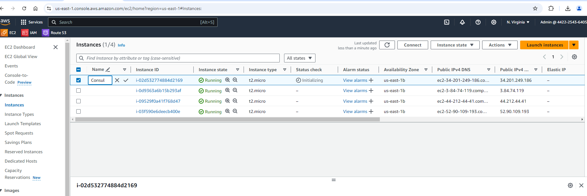

- Name your Consul server, LoadBalancer server, and the two backend servers for easy identification.
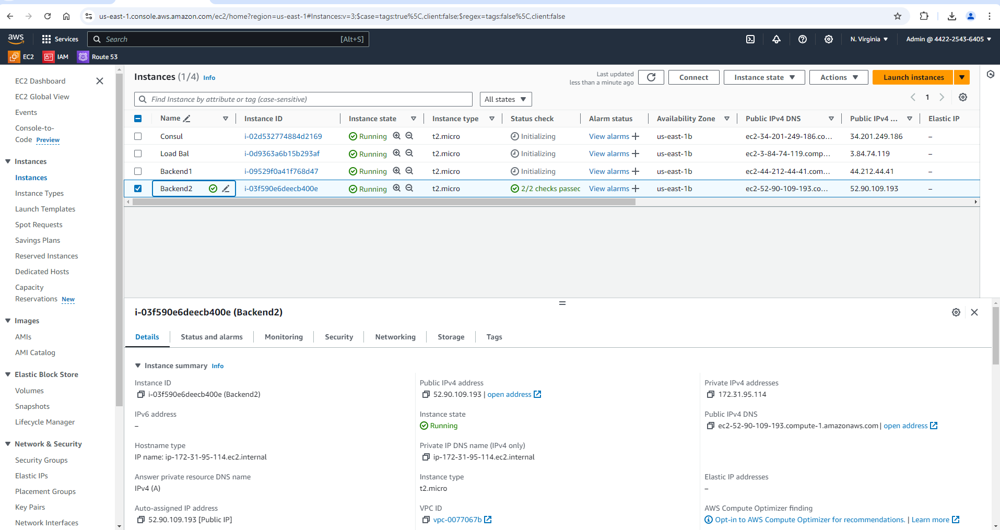

### Allow Required Ports In The Security Group

The Consul service requires specific ports to function correctly. Please open the following ports in your security group.

### Consul Servers

|S/N |Port Name  |Protocol      |Default Port   |
|----|-----------|--------------|---------------|
| 1  |DNS        |TCP and UDP   |8600           |
| 2  |HTTP API   |TCP           |8500           |
| 3  |HTTPS API  |TCP           |8501           |
| 4  |gRPC       |TCP           |8502           |
| 5  |gRPC TLS   |TCP           |8503           |
| 6  |Server RPC |TCP           |8300           |
| 7  |LAN Serf   |TCP and UDP   |8301           |
| 8  |WAN Serf   |TCP and UDP   |8302           |

- Select the **checkbox** next to your instance, click on **Security①**, and then click on the **security group ID②**.
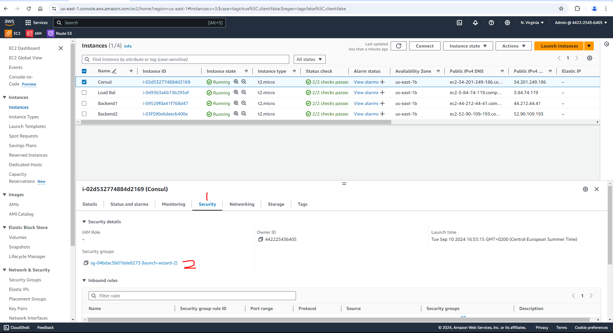

- Click on **Edit inbound rules**.

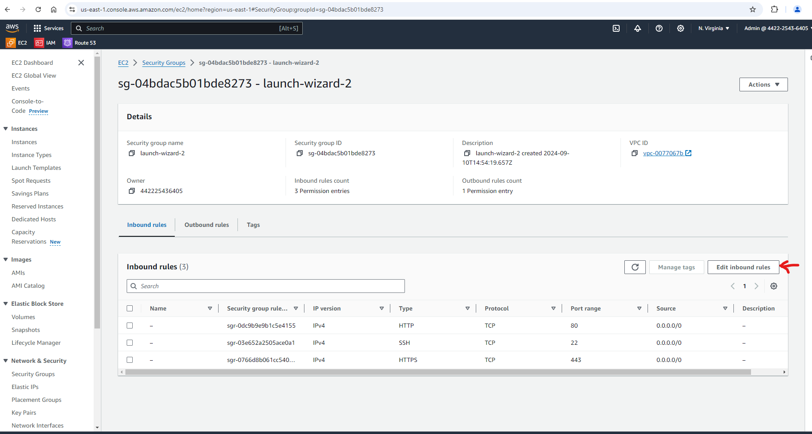

- Click on **Add rule**.

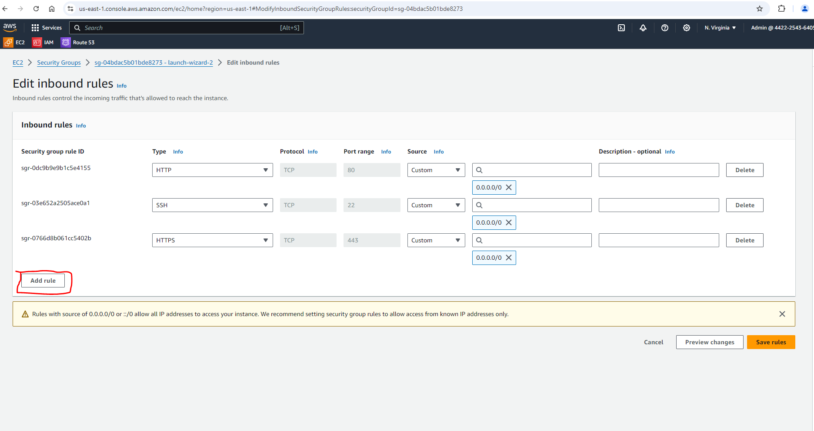

- Select **custom UDP** or **custom TCP** depending on which one you want to add, Enter the **Port range according to the table above**.


> [!NOTE]
This port supports both TCP and UDP protocols, so you'll need to configure both.

- Choose the appropriate CIDR block.

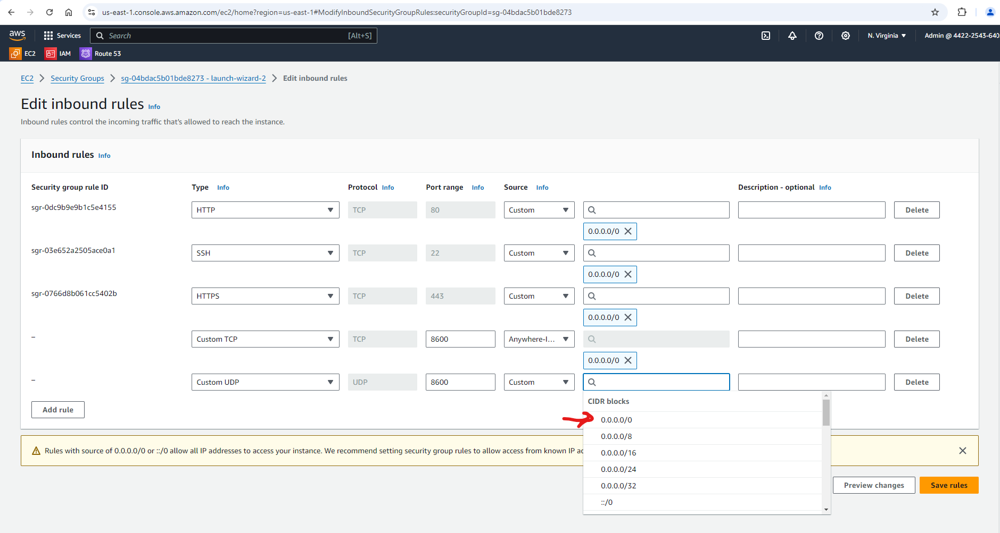

> [!NOTE]
For the purpose of this project, security measures have been intentionally relaxed by opening SSH, HTTP, HTTPS, and Consul ports to all traffic (0.0.0.0) for rapid development and testing. This configuration is highly insecure and should never be used in production environments.
In a production setting, it is crucial to:
Create separate security groups for each type of instance (consul server, backend server, load balancer), strictly limit inbound and outbound traffic to necessary ports and IP addresses, and implement additional security measures like network ACLs, IAM roles, and encryption.
By following these guidelines, you can significantly enhance the security of your infrastructure and protect your systems from unauthorized access.

> [!NOTE]
Repeat this process until you've opened up all necessary ports.

- Verify that all the necessary ports are open.

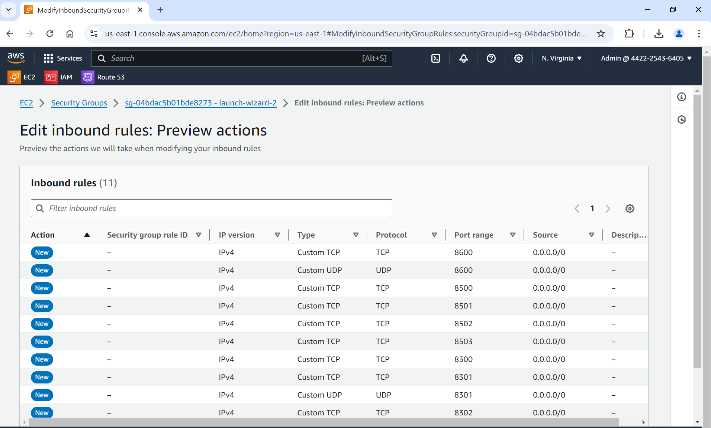

- Click on **Save rules** to apply the updated security group settings.

> [!NOTE]
Currently, the ports are being opened manually one at a time. However, in future projects, you'll learn how to automate these tasks, such as creating multiple instances and configuring all the security group rules at once using code. You'll explore this further when you work with Terraform.

---

### Setup Consul Server

- SSH into the consul server and run **`sudo apt update`** and **`sudo apt upgrade`** to refresh the package cache.
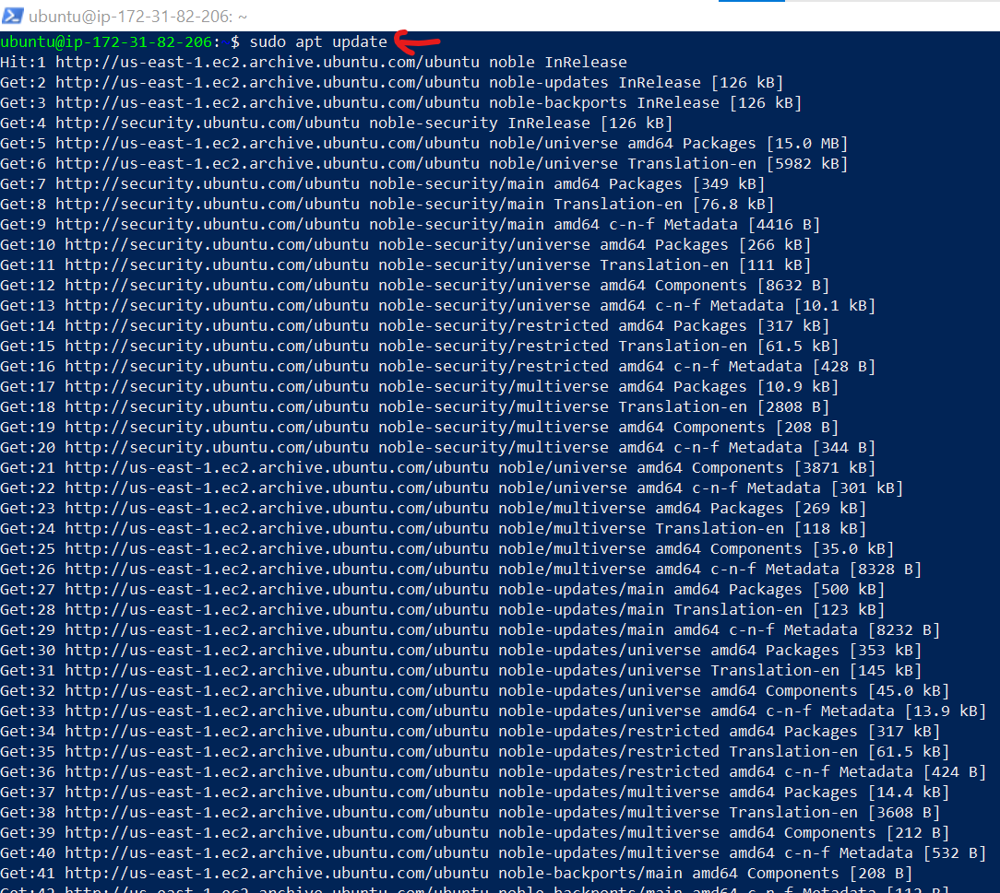 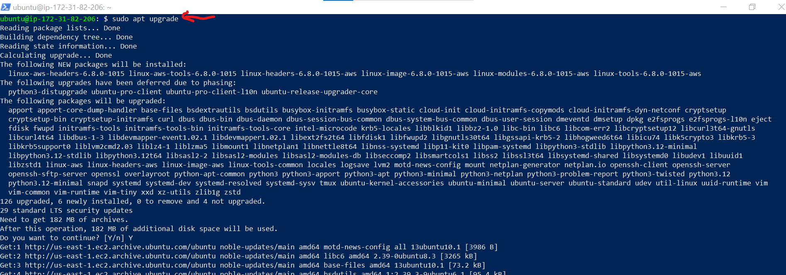

- Visit the consul [**downloads**](https://developer.hashicorp.com/consul/install) page to **copy** the installation command.

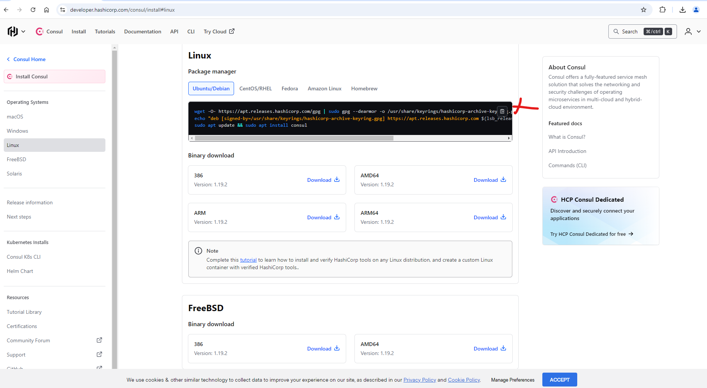

Or execute the following commands to install Consul.

```
wget -O- https://apt.releases.hashicorp.com/gpg | gpg --dearmor | sudo tee /usr/share/keyrings/hashicorp-archive-keyring.gpg

echo "deb [signed-by=/usr/share/keyrings/hashicorp-archive-keyring.gpg] https://apt.releases.hashicorp.com $(lsb_release -cs) main" | sudo tee /etc/apt/sources.list.d/hashicorp.list

sudo apt update && sudo apt install consul
```
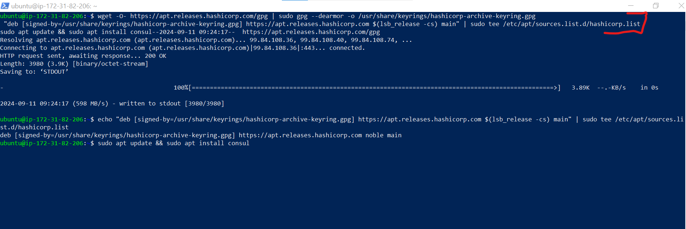

- Confirm Consul installation by checking its version with the **`consul --version`** command.

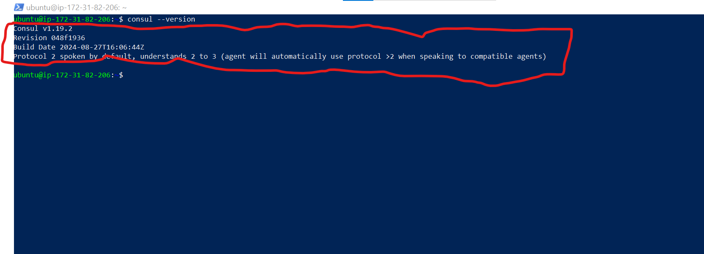

- All the Consul server configurations are located in the **`/etc/consul.d`** folder. To configure the Consul server, start by backing up the default configuration file **`consul.hcl`** by renaming it to **`consul.hcl.back`**, using the following command: **`sudo mv /etc/consul.d/consul.hcl /etc/consul.d/consul.hcl.back`**

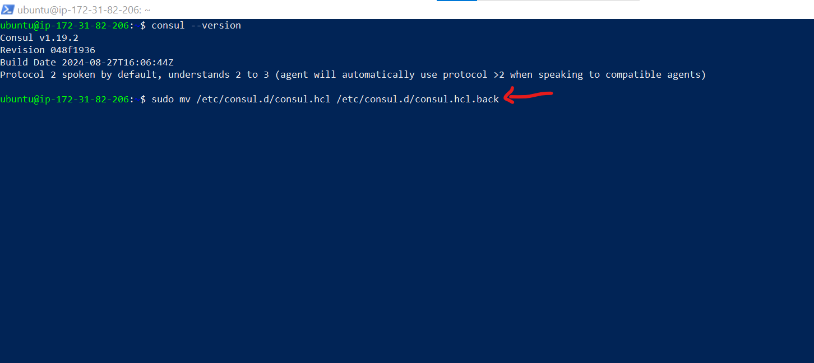

- Generate an **encrypted key** using the **`consul keygen`** command
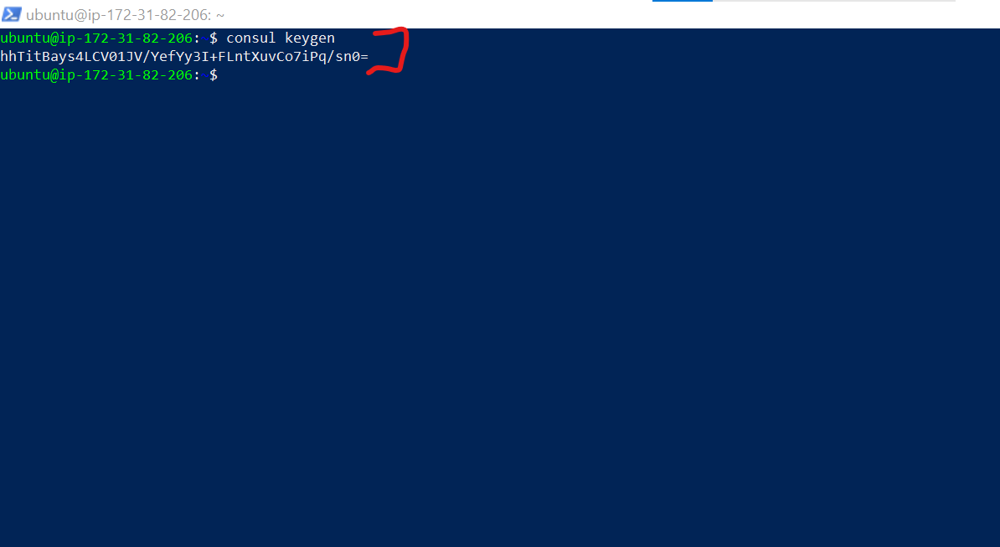

- Create a new file named **`consul.hcl`** in the **`/etc/consul.d`** directory, using the following command: **`sudo vi /etc/consul.d/consul.hcl`**
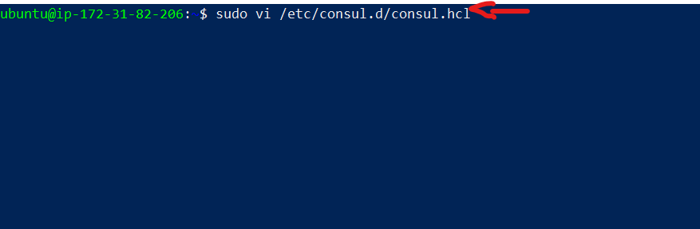

- Add the following content to the **`consul.hcl`** file, replacing **<YOUR_ENCRYPTED_KEY>** with the encrypted key you generated:

```
"bind_addr" = "0.0.0.0"
"client_addr" = "0.0.0.0"
"data_dir" = "/var/consul"
"encrypt" = "<YOUR_ENCRYPTED_KEY>"
"datacenter" = "dc1"
"ui" = true
"server" = true
"log_level" = "INFO"
```
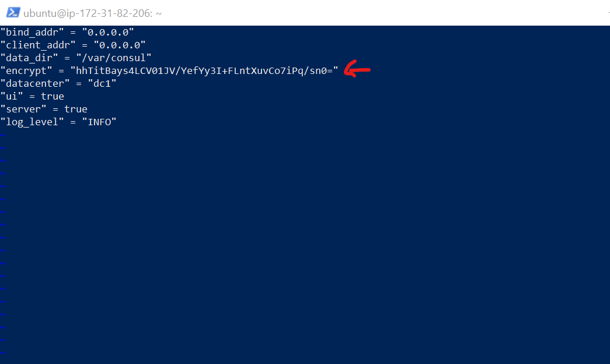

Save this file after adding the content.

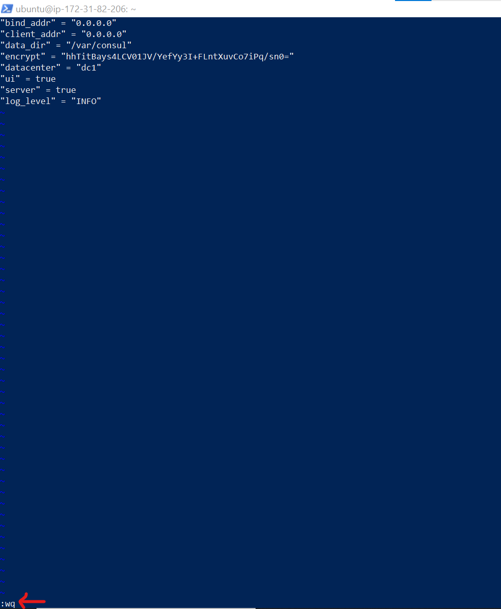

---

**Here's an explanation of each configuration setting in the Consul configuration file:**

1. **`bind_addr = "0.0.0.0"`**: Specifies the IP address on which Consul will bind to listen for incoming connections. `0.0.0.0` means Consul will listen on all available network interfaces.

2. **`client_addr = "0.0.0.0"`**: Determines the IP address on which the Consul client API will be available. Setting it to `0.0.0.0` allows connections from any IP address.

3. **`data_dir = "/var/consul"`**: Specifies the directory where Consul will store its data, such as the state and logs.

4. **`encrypt = "<YOUR_ENCRYPTED_KEY>"`**: Sets the encryption key for securing communication between Consul servers and clients. Replace this placeholder with your actual generated encryption key.

5. **`datacenter = "dc1"`**: Defines the datacenter name that this Consul server will use. Consul uses datacenters to organize services and nodes.

6. **`ui = true`**: Enables the Consul Web UI. This provides a graphical interface for interacting with Consul's data.

7. **`server = true`**: Indicates that this instance is a Consul server. Server nodes participate in the consensus protocol and store the state of the system.

8. **`log_level = "INFO"`**: Sets the verbosity of the logs. `INFO` level provides a balance of details, logging general information, warnings, and errors.

---

- Run the following command to start the Consul server in the background: **`sudo nohup consul agent -dev -config-dir /etc/consul.d/ &`**.

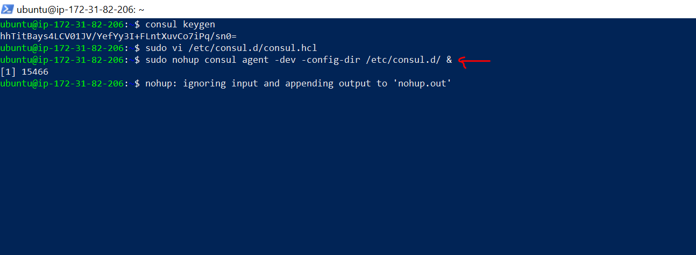

> [!NOTE]
We use the **`-dev`** flag to indicate that we are running a single Consul server in development mode.

- You can check the status of the Consul server with the following command: **`consul members`**.

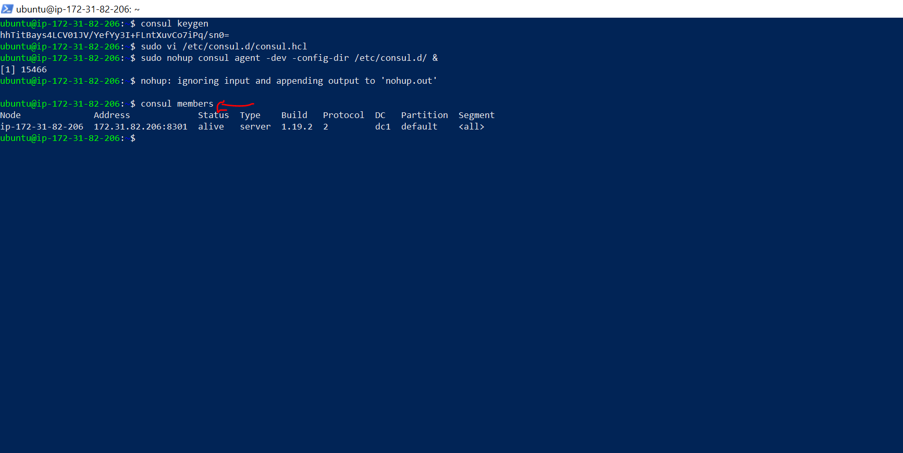

- If you visit **`<EC2 Consul Server IP>:8500`**, you should be able to access the Consul dashboard.

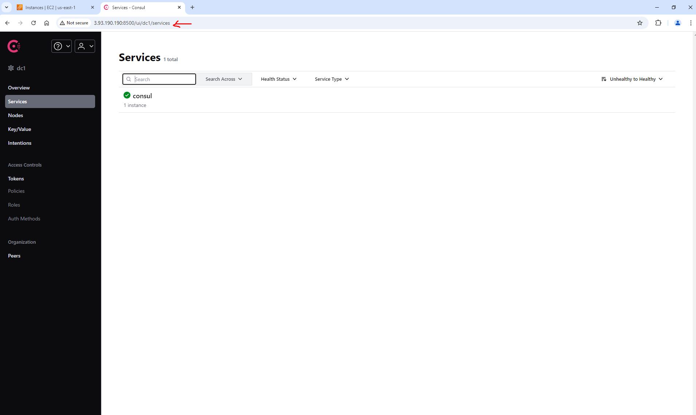

> [!NOTE]
Ensure you replace **`<EC2 Consul Server IP>`** with the public IP address of the EC2 instance you're using as the Consul server.

---
### Setup Backend Servers

Since we have the Consul server up and running, let's manage our Nginx backend servers more easily using service discovery. To do this, we'll install Nginx and the Consul agent on all the backend servers. The Consul agent acts like a messenger, automatically registering both the server and the Nginx service running on it with the Consul server, which acts like a central directory.

**Apply the configurations below on both backend servers:**

- SSH into the backend servers and run **`sudo apt-get update -y`** to update package information.

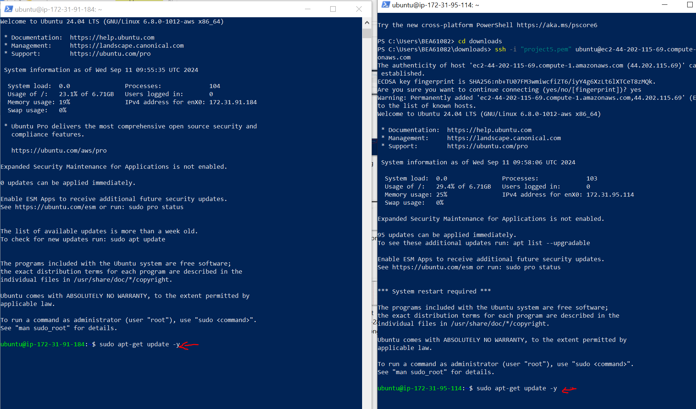

> [!NOTE]
The `y` flag automatically answers **"yes"** to any prompts during the installation process, ensuring that the installation proceeds without requiring manual confirmation.

- Install Nginx on both instances by running the following command: **`sudo apt install nginx -y`**.
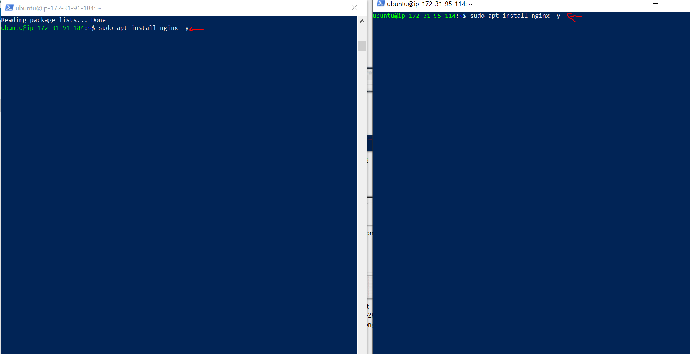

> [!NOTE]
After installing Nginx, navigate to the default HTML directory and modify the index.html file on both servers to differentiate them.

- Navigate to the HTML directory by executing the following command: **`cd /var/www/html`**.

- Open the HTML file with your preferred text editor to make edits: **`sudo vi index.html`**.

- Copy the HTML content below into the index.html file. On the second server, replace **SERVER-01** with **SERVER-02** in the HTML file to differentiate between the two backend servers.

```
<!DOCTYPE html>
<html>
<head>
	<title>Kanekis Backend Server </title>
</head>
<body>
	<h1>This is Backend SERVER-01</h1>
</body>
</html>
```
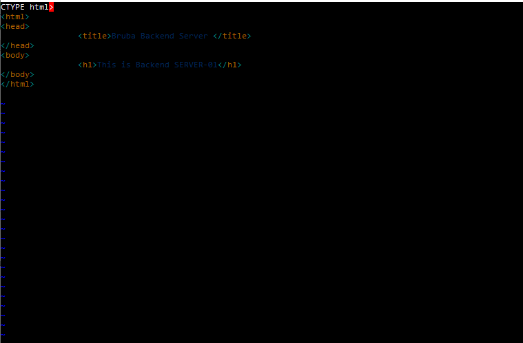 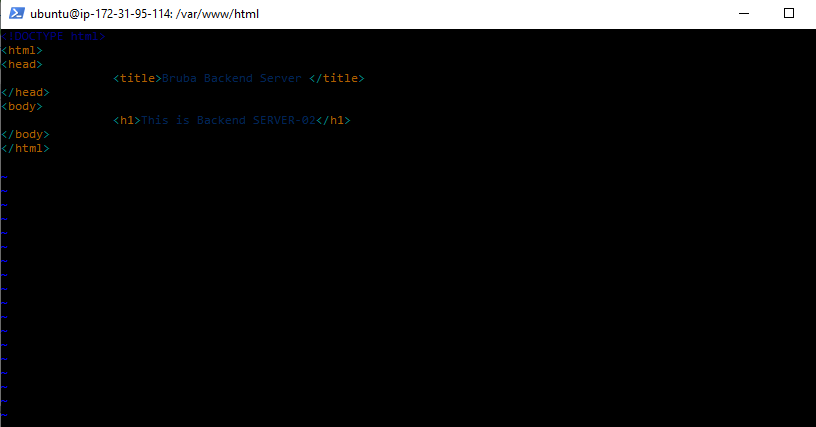

- Install Consul as an agent on the servers. Run the following commands to install Consul:

```
wget -O- https://apt.releases.hashicorp.com/gpg | gpg --dearmor | sudo tee /usr/share/keyrings/hashicorp-archive-keyring.gpg

echo "deb [signed-by=/usr/share/keyrings/hashicorp-archive-keyring.gpg] https://apt.releases.hashicorp.com $(lsb_release -cs) main" | sudo tee /etc/apt/sources.list.d/hashicorp.list

sudo apt update && sudo apt install consul
```
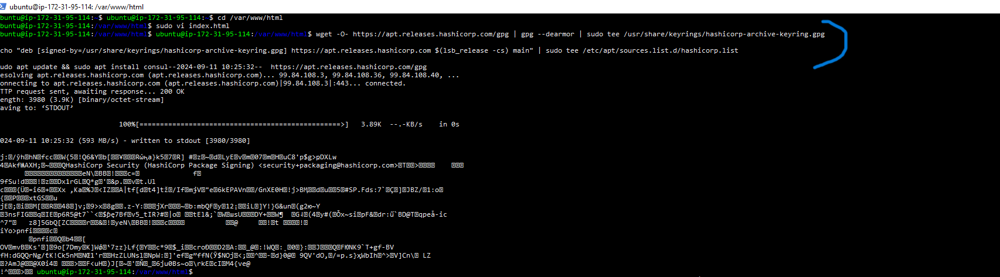

- Verify that Consul is installed properly by running the following command: **`consul --version`**.

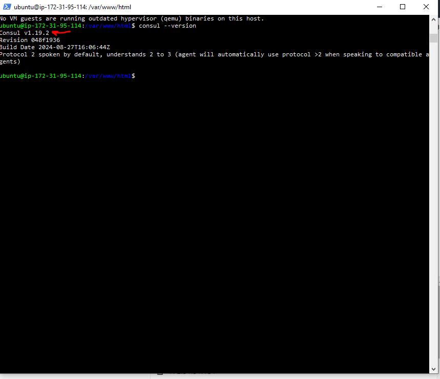

- Replace the default Consul configuration file **`config.hcl`** located in **`/etc/consul.d`** with your custom **`consul.hcl`** file.

- Rename the default file and create a new one by running the following commands:

```
sudo mv /etc/consul.d/consul.hcl /etc/consul.d/consul.hcl.back
sudo vi /etc/consul.d/consul.hcl
```

- Add the following contents to the file. Replace **`<YOUR_ENCRYPTED_KEY>`①** with your encryption key. Also, replace **`3.93.190.190`②** with your Consul server's IP address.

```
"server" = false
"datacenter" = "dc1"
"data_dir" = "/var/consul"
"encrypt" = "<YOUR_ENCRYPTED_KEY>"
"log_level" = "INFO"
"enable_script_checks" = true
"enable_syslog" = true
"leave_on_terminate" = true
"start_join" = ["3.93.190.190"]
```
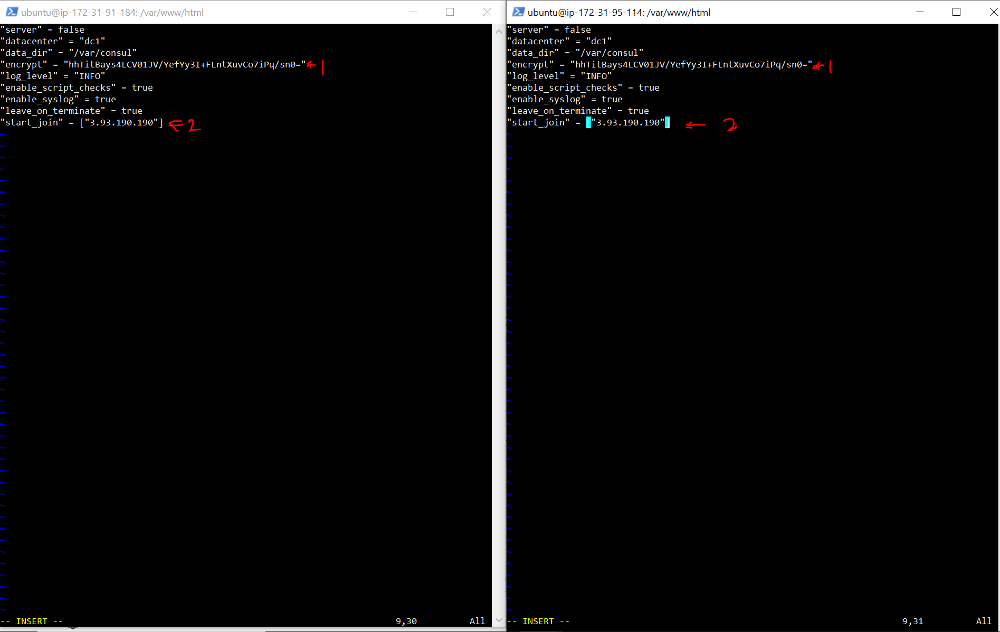
---

**Here's an explanation of the Consul agent configuration settings:**

1. **`server = false`**: Indicates that this node is not a Consul server, but a client (agent). A Consul server handles requests from other Consul agents, while a client node registers services and performs checks.

2. **`datacenter = "dc1"`**: Specifies the datacenter name where the Consul agent operates. This should match the datacenter configuration on the Consul server to ensure proper communication.

3. **`data_dir = "/var/consul"`**: Defines the directory where the Consul agent will store its data files. This directory must be writable by the Consul agent process.

4. **`encrypt = "<YOUR_ENCRYPTED_KEY>"`**: Provides the encryption key for securing communication between Consul agents and the Consul server. Replace **`<YOUR_ENCRYPTED_KEY>`** with the actual key generated using **`consul keygen`**.

5. **`log_level = "INFO"`**: Sets the verbosity of the log output. **`INFO`** level provides a balance between detail and readability, showing general information about Consul operations.

6. **`enable_script_checks = true`**: Enables the execution of script-based health checks. When set to **`true`**, the Consul agent can run custom scripts to check service health.

7. **`enable_syslog = true`**: Allows logging of Consul messages to the syslog service. When enabled, logs will be sent to the system's logging facility, which can be useful for centralized logging and monitoring.

8. **`leave_on_terminate = true`**: Ensures that the Consul agent will automatically deregister itself from the Consul server when the agent process is terminated. This helps maintain accurate service registration and avoids stale entries.

9. **`start_join = ["3.93.190.190"]`**: Lists the addresses of Consul servers or agents that this Consul client should contact when starting up to join the Consul cluster. Replace **`3.93.190.190`** with the IP address of your Consul server. This setting helps the agent locate and connect to the Consul server to begin registering services.

---

- Next, we need to create a **`backend.hcl`** configuration file in the **`/etc/consul.d`** directory to register the Nginx service and its health check URLs with the Consul server. This will enable the Consul server to continuously monitor the health of the Nginx service. Use the following command to create and edit the file: **`sudo vi /etc/consul.d/backend.hcl`**.

- Add the following contents to the **`backend.hcl`** file and save it.

```
"service" = {
  "Name" = "backend"
  "Port" = 80
  "check" = {
    "args" = ["curl", "localhost"]
    "interval" = "3s"
  }
}
```
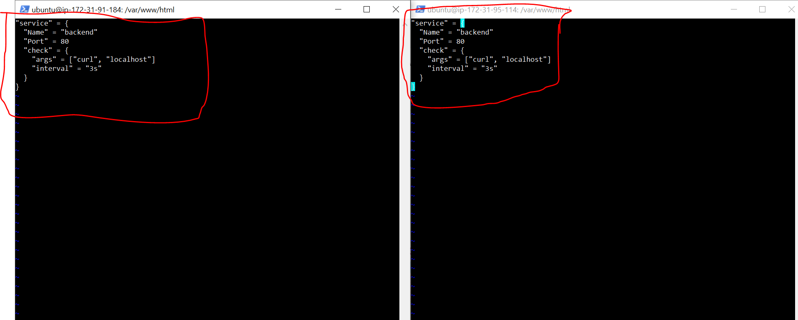
