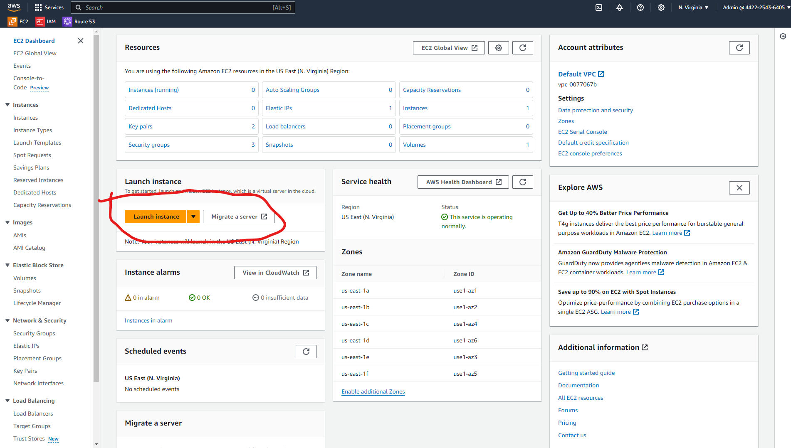
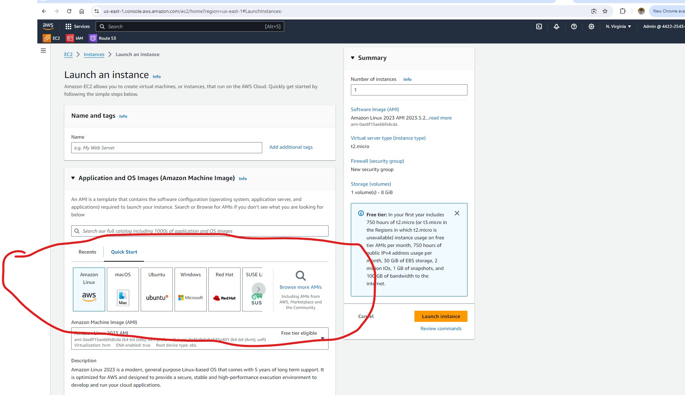

# Setup a Static Website Using Nginx
 - these are the steps to accomplish this
### Create An Ubuntu Server
- create an account on AWS
- locate EC2
- EC2 enables you to start varoius operating systems within the AWS cloud environment

- Click on **Launch Instance**

- you can see a veriety of instances, for this i chose Ubuntu
- **Name** your instance and select the **Ubuntu** AMI.