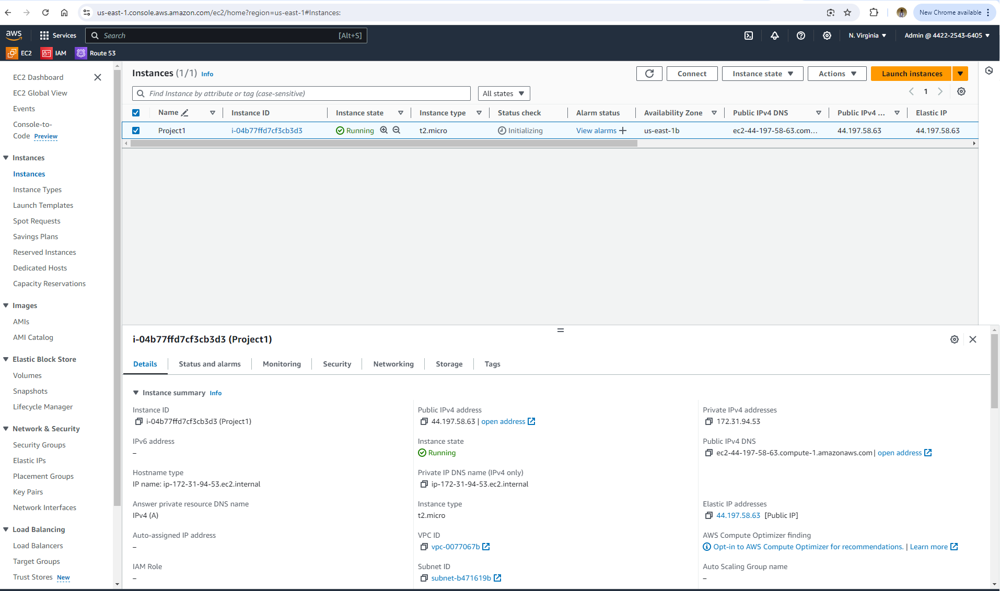
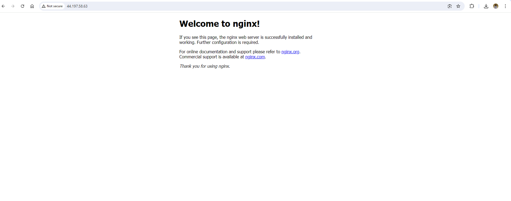

# Setup a Static Website Using Nginx
 - these are the steps to accomplish this
### Create An Ubuntu Server on AWS
- create an account on AWS
- locate EC2
- EC2 enables you to start varoius operating systems within the AWS cloud environment

- Click on **Launch Instance**

- you can see a variety of instances, for this i chose Ubuntu
- **Name** your instance and select the **Ubuntu** AMI.

- confirm that the instance is up and running

### Create and Assign an Elastic IP

- Select **Elastic IPs** under **Network & Security**

### Install Nginx
- Execute the following commands.

`sudo apt update`

`sudo apt upgrade`

`sudo apt install nginx`

- Start your Nginx server by running the **`sudo systemctl start nginx`** command, enable it to start on boot by executing **`sudo systemctl enable nginx`**, and then confirm if it's running with the **`sudo systemctl status nginx`** command.

